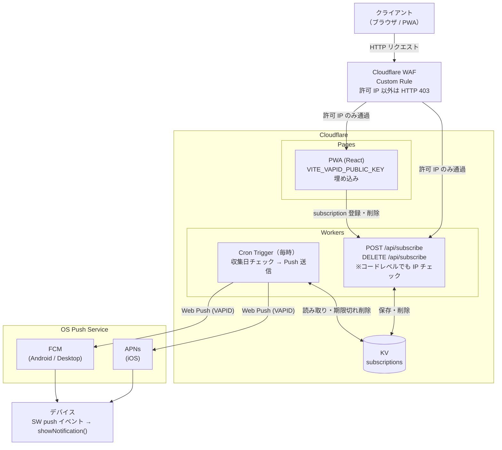

# Push通知 実装設計

## 現状の分析

- `notificationStore.ts`・`Settings.tsx` の UI は既にある（トグル・時刻選択）
- 実際の通知スケジューリングロジックがまだない
- `vite-plugin-pwa` は導入済みで `generateSW` モードで動作中

## 基本方針

**Web Push API（VAPID）+ Cloudflare Workers** で実装する。iOS を含む全プラットフォームのバックグラウンド通知に対応する。

```
PWA（Cloudflare Pages）
  └─ push subscription → Cloudflare Workers
                              ├─ Cron Trigger（毎時）
                              │    └─ 収集日チェック → Web Push 送信
                              └─ Cloudflare KV（subscription 保存）
```

---

## 変更ファイル一覧

| ファイル | 種別 | 概要 |
|---|---|---|
| `src/sw.ts` | 新規 | カスタム Service Worker |
| `src/hooks/useNotification.ts` | 新規 | 権限取得・Periodic Sync 登録・SW 連携フック |
| `src/store/notificationStore.ts` | 変更 | `permission` 状態を追加 |
| `src/pages/Settings.tsx` | 変更 | `useNotification` フックに切り替え |
| `vite.config.ts` | 変更 | `generateSW` → `injectManifest` モードに切替 |

---

## 各レイヤーの責務

```
Settings.tsx         → UI のみ（トグル・時刻選択）
useNotification.ts   → 権限取得・Periodic Sync 登録・SW へのメッセージング
notificationStore.ts → 設定値の永続化（localStorage）
sw.ts                → 収集日チェック・通知表示・設定の受信と IndexedDB 保存
```

---

## Service Worker の設計

### なぜ `injectManifest` に切り替えるか

`generateSW`（現在）は Workbox が SW を自動生成するため、カスタムロジックを追加できない。
`injectManifest` にすると `src/sw.ts` を Vite でビルドできるため、`src/data/schedule.ts` を import するだけでスケジュールデータを SW 内で使える。JSON ファイルの二重管理が不要になる。

### SW が処理するイベント

| イベント | 処理 |
|---|---|
| `message: SET_SETTINGS` | 設定を IndexedDB に保存（SW 再起動後も維持） |
| `message: SYNC_NOW` | アプリ起動時の即時通知チェック |
| `periodicsync: check-collection` | バックグラウンドでの毎日チェック |
| `notificationclick` | アプリを前面に表示 |

### 通知タイミングのロジック

```
現在時刻が [設定時刻, 設定時刻+1時間) の範囲 かつ 本日まだ通知していない → 通知する
```

**重複送信防止**: IndexedDB に `notified-YYYY-MM-DD-morning` / `notified-YYYY-MM-DD-evening` のキーを記録する。

### 通知の文言例

```
【前日夜 20:00】
タイトル: ごみの日のお知らせ
本文:    明日（7/20・月）は燃えないごみ・古紙類の日です

【当日朝 7:00】
タイトル: ごみの日のお知らせ
本文:    今日（7/20・月）は燃えないごみ・古紙類の日です
```

---

## データフロー

```
アプリ起動
  └─ useNotification (useEffect)
       ├─ SW に SET_SETTINGS を送信（最新設定を同期）
       └─ SW に SYNC_NOW を送信

ユーザーが通知トグルを ON
  ├─ Notification.requestPermission()
  ├─ Periodic Background Sync 登録
  │    navigator.serviceWorker.ready
  │      .then(r => r.periodicSync.register('check-collection', { minInterval: 24h }))
  └─ SW に SET_SETTINGS を送信

SW (periodicsync / SYNC_NOW)
  ├─ IndexedDB から設定を読み込む
  ├─ 現在時刻と設定時刻を比較
  ├─ schedule.ts から今日・明日の収集品目を取得
  ├─ 通知済みキーを確認
  └─ 未通知なら showNotification() → キーを記録
```

---

## `notificationStore` への追加

```typescript
// 現在の状態に追加
permission: NotificationPermission  // 'default' | 'granted' | 'denied'
setPermission: (p: NotificationPermission) => void
```

---

## ブラウザ対応

| 環境 | 動作 |
|---|---|
| Chrome/Edge (Android) - PWA インストール済み | Web Push でバックグラウンド通知 ○ |
| Chrome/Edge (Desktop) | Web Push でバックグラウンド通知 ○ |
| Safari iOS 16.4+ - PWA インストール済み | Web Push でバックグラウンド通知 ○ |
| Safari iOS < 16.4 | 通知 API 非対応のため UI で非表示 |

---

## Web Push API インフラ設計

### コンポーネント構成



### Cloudflare リソース一覧

| リソース | 用途 | 備考 |
|---|---|---|
| Cloudflare Pages | PWA ホスティング | 既存 |
| Cloudflare Workers | Push サーバー API + Cron | 新規 |
| Cloudflare KV | Push subscription 保存 | 新規 |
| VAPID キーペア | Web Push 認証 | 1回生成・シークレットに保存 |

### VAPID キー管理

```bash
# 1回だけ生成する
npx web-push generate-vapid-keys

# 公開鍵 → Cloudflare Pages の環境変数
VITE_VAPID_PUBLIC_KEY=...

# 秘密鍵 → Cloudflare Workers のシークレット（wrangler secret put）
VAPID_PRIVATE_KEY=...
VAPID_SUBJECT=mailto:ti2236sh@gmail.com
```

### Cloudflare Workers API

#### `POST /api/subscribe`

Push subscription を KV に登録する。

**リクエスト Body**:
```json
{
  "subscription": {
    "endpoint": "https://fcm.googleapis.com/...",
    "keys": { "p256dh": "...", "auth": "..." }
  },
  "morningHour": 7,
  "eveningHour": 20
}
```

**KV キー**: `sub:{endpoint の SHA-256 先頭16文字}`

**KV バリュー**:
```json
{
  "endpoint": "...",
  "keys": { "p256dh": "...", "auth": "..." },
  "morningHour": 7,
  "eveningHour": 20,
  "subscribedAt": "2026-07-19T12:00:00Z"
}
```

#### `DELETE /api/subscribe`

```json
{ "endpoint": "https://fcm.googleapis.com/..." }
```

KV から該当エントリを削除する。

#### Cron Trigger（`0 * * * *` — 毎時0分 UTC）

```
1. KV から全 subscription を取得
2. 現在の JST 時刻（UTC+9）を計算
3. 各 subscription の morningHour / eveningHour と比較
4. 一致した subscription に対して:
   a. 収集スケジュールデータから対象日の品目を取得
      - morningHour 一致 → 今日の品目
      - eveningHour 一致 → 明日の品目
   b. 品目がある場合のみ Web Push を送信
5. 送信失敗（HTTP 410 Gone）→ KV から subscription を削除
```

**スケジュールデータの扱い**:
収集スケジュールは静的データのため、Workers のコードにバンドルする（JSON ファイルを import）。

### Cloudflare Workers ディレクトリ構成

```
workers/
├── src/
│   ├── index.ts          # API エントリポイント（Hono）
│   ├── cron.ts           # Cron Trigger ハンドラ
│   ├── webpush.ts        # VAPID 署名・Push 送信ユーティリティ
│   └── schedule.json     # 収集スケジュールデータ（PWA と共有）
├── wrangler.toml
└── package.json
```

> `schedule.json` は `src/data/schedule.ts` をビルド時に変換して生成する。PWA と Workers で同一ソースを参照する。

### PWA 側の変更（`useNotification.ts`）

```typescript
// 通知を有効にする際の処理
async function subscribe() {
  const registration = await navigator.serviceWorker.ready
  const subscription = await registration.pushManager.subscribe({
    userVisibleOnly: true,
    applicationServerKey: import.meta.env.VITE_VAPID_PUBLIC_KEY,
  })
  await fetch('/api/subscribe', {
    method: 'POST',
    headers: { 'Content-Type': 'application/json' },
    body: JSON.stringify({ subscription, morningHour, eveningHour }),
  })
}

// 通知を無効にする際の処理
async function unsubscribe() {
  const registration = await navigator.serviceWorker.ready
  const subscription = await registration.pushManager.getSubscription()
  if (subscription) {
    await fetch('/api/subscribe', {
      method: 'DELETE',
      headers: { 'Content-Type': 'application/json' },
      body: JSON.stringify({ endpoint: subscription.endpoint }),
    })
    await subscription.unsubscribe()
  }
}
```

### `sw.ts` の追加イベント

```typescript
// Web Push を受信したときに通知を表示
self.addEventListener('push', (event) => {
  const data = event.data?.json()
  event.waitUntil(
    self.registration.showNotification(data.title, {
      body: data.body,
      icon: '/icons/icon-192.png',
      badge: '/icons/icon-192.png',
      data: { url: '/' },
    })
  )
})
```

### コスト試算

| リソース | 無料枠 | 想定使用量 |
|---|---|---|
| Workers リクエスト | 100,000 回/日 | < 100 回/日（個人利用）|
| Workers Cron | 無制限 | 24 回/日 |
| KV 読み取り | 100,000 回/日 | < 50 回/日 |
| KV 書き込み | 1,000 回/日 | < 10 回/日 |

個人利用のスケールでは無料枠内に完全に収まる。

### セキュリティ考慮

- VAPID 秘密鍵は Workers のシークレット（環境変数）に保存し、コードにハードコードしない
- `/api/subscribe` はレートリミット不要（最悪の場合、無関係な subscription が追加されるだけで通知文面は固定）
- subscription の endpoint は他者に知られても Push を送れるわけではない（VAPID 秘密鍵が必要）

---

## IP 制限設計

### 方針

WAF と Workers コードの 2 層で制限する。

| レイヤー | 対象 | 手段 |
|---|---|---|
| Cloudflare WAF Custom Rule | Pages + Workers（ゾーン全体） | 許可 IP 以外を HTTP 403 でブロック |
| Workers コード内チェック | `/api/subscribe` のみ | `CF-Connecting-IP` ヘッダーを検証 |

WAF が第一防衛線、Workers コードが多層防御（WAF をバイパスされた場合のフォールバック）。

### Cloudflare WAF Custom Rule

Terraform で管理する（後述の `cloudflare_ruleset` リソースを参照）。

> Cloudflare Free プランでは Custom Rule を 5 件まで作成できる。Pages と Workers を同じゾーン（ドメイン）に置けば 1 ルールで両方をカバーできる。

### Workers コードレベルの IP チェック

`ALLOWED_IPS` を Workers の環境変数（シークレット不要）に設定し、コード内で検証する。

**`wrangler.toml` への追加**:

```toml
[vars]
ALLOWED_IPS = "203.0.113.1,203.0.113.2"
```

**Worker コード（`src/index.ts`）**:

```typescript
function isAllowedIP(env: Env, clientIP: string): boolean {
  const allowed = env.ALLOWED_IPS.split(',').map((ip) => ip.trim())
  return allowed.includes(clientIP)
}

// API ハンドラの先頭で検証
app.post('/api/subscribe', async (c) => {
  const clientIP = c.req.header('CF-Connecting-IP') ?? ''
  if (!isAllowedIP(c.env, clientIP)) {
    return c.text('Forbidden', 403)
  }
  // ... 以降の処理
})
```

### モバイル回線への対応

モバイル回線（キャリア）は CGNAT により IP が頻繁に変動するため、固定 IP での許可が難しい。

**推奨運用**:

- `/api/subscribe`（通知の有効化）は **自宅 Wi-Fi 接続時にのみ操作する**
- 一度 subscription を登録した後は Cron がサーバーサイドで動作するため、クライアント IP は不要
- 通知の無効化（`DELETE /api/subscribe`）も同様に自宅 Wi-Fi で行う

**外出先から有効化したい場合**:

自宅の VPN（WireGuard 等）経由でアクセスすれば自宅 IP として通過できる。

---

## Terraform 設計

Cloudflare インフラ全体を Terraform で管理する。

### ディレクトリ構成

```
terraform/
├── providers.tf       # Cloudflare provider・State バックエンド
├── variables.tf       # 変数定義
├── main.tf            # リソース定義
├── outputs.tf         # 出力値
└── terraform.tfvars   # 実際の値（.gitignore 対象）
```

### State バックエンド

Terraform State を **Cloudflare R2**（S3 互換）に保存する。Cloudflare に一元化でき、別サービスのアカウント管理が不要。

```hcl
# providers.tf
terraform {
  required_providers {
    cloudflare = {
      source  = "cloudflare/cloudflare"
      version = "~> 4.0"
    }
  }

  backend "s3" {
    endpoint                    = "https://${ACCOUNT_ID}.r2.cloudflarestorage.com"
    bucket                      = "terraform-state"
    key                         = "gomi-no-hi/terraform.tfstate"
    region                      = "auto"
    skip_credentials_validation = true
    skip_metadata_api_check     = true
    skip_region_validation      = true
    force_path_style            = true
    # R2 API トークンを環境変数 AWS_ACCESS_KEY_ID / AWS_SECRET_ACCESS_KEY で渡す
  }
}

provider "cloudflare" {
  api_token = var.cloudflare_api_token
}
```

### 変数一覧

```hcl
# variables.tf
variable "cloudflare_api_token" {
  type      = string
  sensitive = true
}

variable "account_id" {
  type = string
}

variable "zone_id" {
  type = string
}

variable "allowed_ip_addresses" {
  type        = list(string)
  description = "WAF・Workers で許可する IP アドレスのリスト"
}

variable "vapid_public_key" {
  type = string
}

variable "vapid_private_key" {
  type      = string
  sensitive = true
}

variable "vapid_subject" {
  type    = string
  default = "mailto:ti2236sh@gmail.com"
}
```

### リソース定義

```hcl
# main.tf

# ── KV Namespace ──────────────────────────────────────────
resource "cloudflare_workers_kv_namespace" "subscriptions" {
  account_id = var.account_id
  title      = "gomi-no-hi-subscriptions"
}

# ── Workers Script ────────────────────────────────────────
resource "cloudflare_worker_script" "api" {
  account_id = var.account_id
  name       = "gomi-no-hi-api"
  content    = file("../workers/dist/index.js")

  kv_namespace_binding {
    name         = "KV"
    namespace_id = cloudflare_workers_kv_namespace.subscriptions.id
  }

  plain_text_binding {
    name = "ALLOWED_IPS"
    text = join(",", var.allowed_ip_addresses)
  }

  plain_text_binding {
    name = "VAPID_PUBLIC_KEY"
    text = var.vapid_public_key
  }

  secret_text_binding {
    name = "VAPID_PRIVATE_KEY"
    text = var.vapid_private_key
  }

  plain_text_binding {
    name = "VAPID_SUBJECT"
    text = var.vapid_subject
  }
}

# ── Cron Trigger ──────────────────────────────────────────
resource "cloudflare_worker_cron_trigger" "hourly" {
  account_id  = var.account_id
  script_name = cloudflare_worker_script.api.name
  schedules   = ["0 * * * *"]
}

# ── Pages Project ─────────────────────────────────────────
resource "cloudflare_pages_project" "app" {
  account_id        = var.account_id
  name              = "gomi-no-hi"
  production_branch = "main"

  build_config {
    build_command   = "npm run build"
    destination_dir = "dist"
  }

  deployment_configs {
    production {
      environment_variables = {
        VITE_VAPID_PUBLIC_KEY = var.vapid_public_key
      }
    }
  }
}

# ── WAF Custom Rule（IP 許可リスト）──────────────────────
resource "cloudflare_ruleset" "ip_allowlist" {
  zone_id     = var.zone_id
  name        = "IP Allowlist"
  description = "Allow only specified IP addresses"
  kind        = "zone"
  phase       = "http_request_firewall_custom"

  rules {
    action      = "block"
    description = "Block requests from non-allowlisted IPs"
    enabled     = true
    expression  = "not ip.src in {${join(" ", var.allowed_ip_addresses)}}"
  }
}
```

### 出力値

```hcl
# outputs.tf
output "kv_namespace_id" {
  value = cloudflare_workers_kv_namespace.subscriptions.id
}

output "pages_url" {
  value = cloudflare_pages_project.app.subdomain
}
```

### `.gitignore` への追加

```
# terraform/
terraform/.terraform/
terraform/*.tfstate
terraform/*.tfstate.backup
terraform/terraform.tfvars
```

### 運用コマンド

```bash
# 初期化（State バックエンドの接続確認を含む）
terraform -chdir=infra init

# 変更内容のプレビュー
terraform -chdir=infra plan

# 適用
terraform -chdir=infra apply

# Workers のコードを更新した場合（ビルド後に apply）
npm run build --prefix workers
terraform -chdir=infra apply -target=cloudflare_worker_script.api
```

### 注意点

- `vapid_private_key` は `sensitive = true` だが Terraform State には平文で保存される。R2 バケットのアクセス権限を絞ること（パブリックアクセス無効・API トークンで制限）。
- Workers のコードを変更するたびに `workers/dist/index.js` をビルドしてから `terraform apply` が必要。CI/CD で自動化することを推奨。
